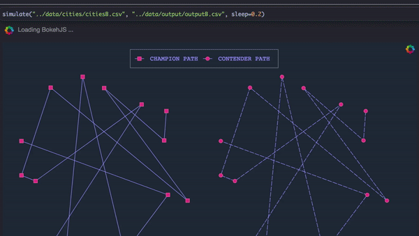
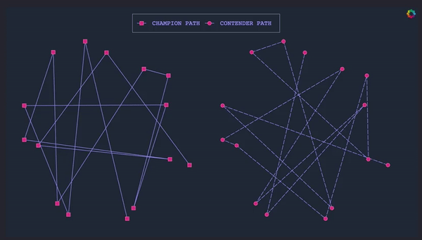
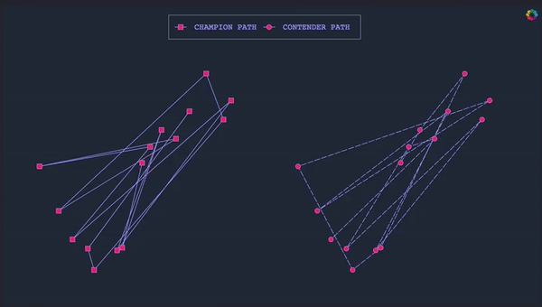

# Rusty Genes
```
$ curl https://sh.rustup.rs -sSf | sh
$ cd citydna
$ cargo build

```
- A Rust implementation of a genetic algorithm to solve the traveling salesman problem with animated visualizations
- [See my Medium article for a more detailed discussion](https://medium.com/@mithi/genetic-algorithms-in-rust-for-autonomous-agents-an-introduction-ac182de32aee)


|       |       |
| ----------------------------- |:-------------------------------:|
|       |         |

# REFERENCES
- [Genetic Algo Tech Talk Video](https://youtu.be/XP8R0yzAbdo?t=4m14s)
- [Genetic Algo Tech Talk Repo](https://github.com/ptrkkim/Genetic-Algo-Tech-Talk/blob/master/public/js/Population.js)
- [Coding Train Video](https://www.youtube.com/watch?v=hnxn6DtLYcY)
- [Coding Train Repo](https://github.com/shiffman/NOC-S17-2-Intelligence-Learning/blob/master/week2-evolution/03_TSP_GA_crossover/dna.js)


# [🐳](https://mithi.github.io/deep-blueberry) [☕️](https://ko-fi.com/minimithi) [🧧](https://www.paypal.me/minimithi) [](https://saythanks.io/to/mithi)
```
33Mudy961bUk9zz35p68g9fE3uuHLRduRp
```

