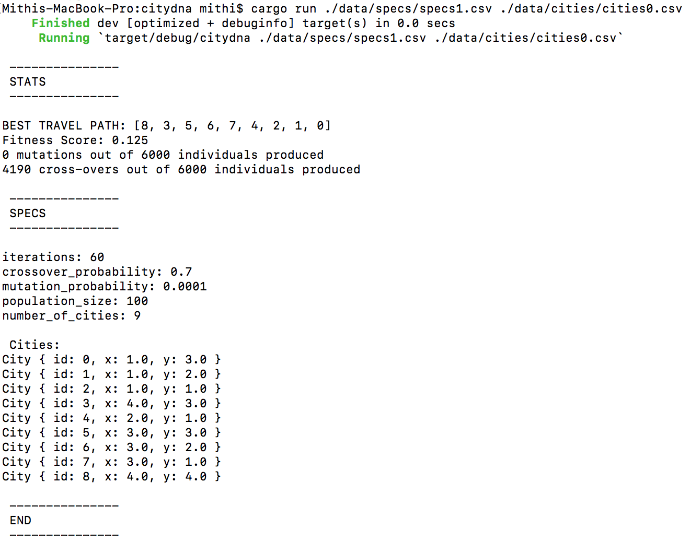

# INTRODUCTION
- A Rust implementation of a genetic algorithm to solve the traveling salesman problem with animated visualization (jupyter notebook)
- [See my Medium article for a more detailed discussion](https://medium.com/@mithi/genetic-algorithms-in-rust-for-autonomous-agents-an-introduction-ac182de32aee)

|       |         |
| ----------------------------- |:-------------------------------:|
|       |         |


# GETTING STARTED
```bash
$ cargo test -- --nocapture
$ cargo build
$ cargo run ./data/specs/specs1.csv ./data/cities/cities0.csv
```



# SIMULATION
```bash
$ cargo run ./specs.csv ./cities.csv > ./output.csv

# ------------
# ./specs.csv
# ------------
debug_level, skip, iterations, population_size, crossover_probability, mutation_probability

where:
- debug_level: 0, 1, 2, 3 or 4
- skip: row in csv file will be written when iteration % skip == 0, should be unsigned integer >= 1
- iterations: unsigned integer
- population_size: should be an even integer and divisible by ten
- crossover_probability: between 0.0 and 1.0
- mutation_probability: between 0.0 and 1.0

# ------------
# ./cities.csv
# ------------
id1, x1, y1
id2, x2, y2
# --- snip ---
idn, xn, yn

# ------------
# ./output.csv
# ------------
iteration_step, number_of_cities, champion_fitness, challenger_fitness, champion_dna, challenger_dna
# --- snip ---

```


# SAMPLE USAGE, KNOWN ISSUES, AND FUTURE FEATURES
- See [`SAMPLECODE1.md`](./docs/SAMPLECODE1.md) and [`SAMPLECODE2.md`](./docs/SAMPLECODE2.md) in [`docs`](./docs) 
  directory for sample code
- See `TODO.md` in `docs` directory for known issues and future features

# JUPYTER NOTEBOOKS FOR SEMI RANDOM CITY GENERATION AND ANIMATED VISUALIZATION
- **IMPORTANT**: When running the simulation:
  - Use `debug_level = 1` to generate output `csv` file compatible with the helper scripts that you can use
  for your own notebooks
- To launch notebooks, check this [how-to](./notebooks/README.md) to set up your conda environment
- To launch a visual animation of the the search checkout [EXAMPLE 2 of the second section of this markdown](./notebooks/README.md), you can use the helper function `simulate()` with pre-generated city configuations and corresponding outputs that can be found in the `./data` directory (see SAMPLE DATA section below)
- To create `csv` files of semi-random cities with [[EXAMPLE 1 of the second section of this markdown](./notebooks/README.md)


# SAMPLE DATA
- Check the [`./data/`](./data/) directory for sample `csv` files used directly with the notebooks
- `csv` files in [`./data/output/`](./data/output/) directory used in the notebooks were generated by running the simulation (see next section)
- `csv` files in [`./data/cities/`](./data/cities/) directory are mostly generated with [EXAMPLE 1 of the second section of this markdown](./notebooks/README.md),


# REFERENCES
- [Genetic Algo Tech Talk Video](https://youtu.be/XP8R0yzAbdo?t=4m14s)
- [Genetic Algo Tech Talk Repo](https://github.com/ptrkkim/Genetic-Algo-Tech-Talk/blob/master/public/js/Population.js)
- [Coding Train Video](https://www.youtube.com/watch?v=hnxn6DtLYcY)
- [Coding Train Repo](https://github.com/shiffman/NOC-S17-2-Intelligence-Learning/blob/master/week2-evolution/03_TSP_GA_crossover/dna.js)
