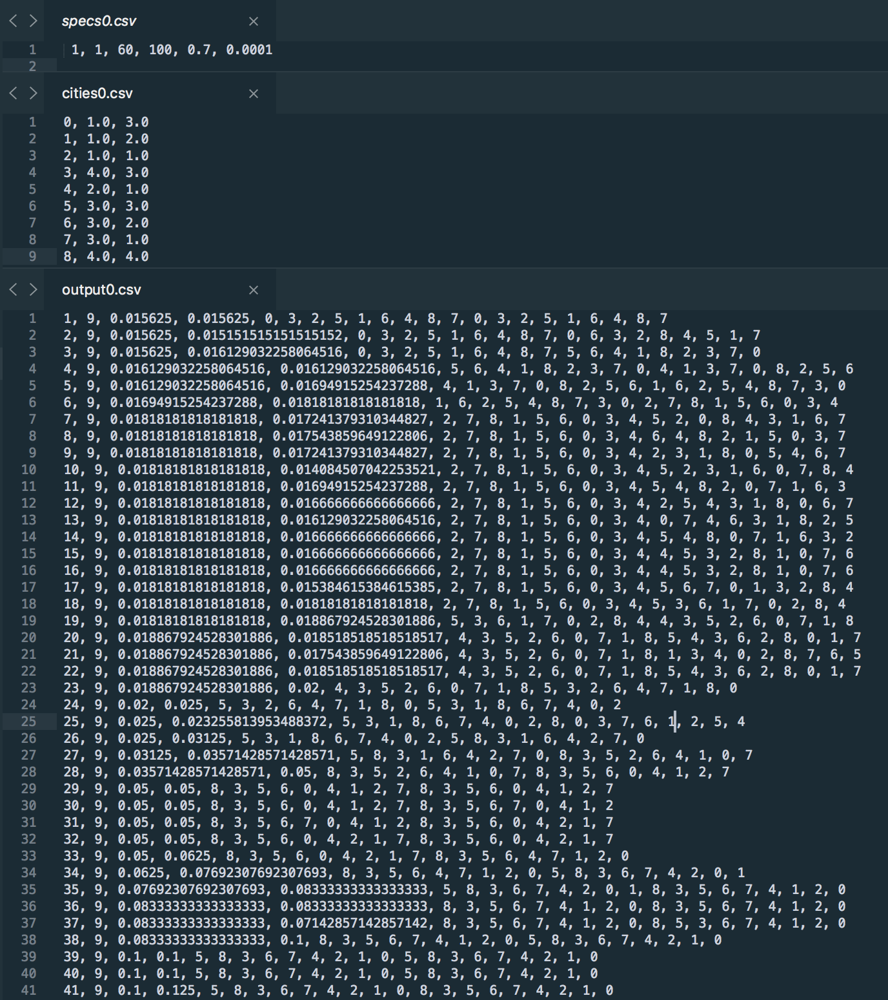

# Setup
```bash
$ cargo test -- --nocapture
$ cargo build
$ cargo run ../data/specs/specs1.csv ../data/cities/cities0.csv
```


# Simulation
```bash
$ cargo run ./specs.csv ./cities.csv > ./output.csv

# ------------
# ./specs.csv
# ------------
debug_level, skip, iterations, population_size, crossover_probability, mutation_probability

where:
- debug_level: 0, 1, 2, 3 or 4
- skip: row in csv file will be written when iteration % skip == 0, should be unsigned integer >= 1
- iterations: unsigned integer
- population_size: should be an even integer and divisible by ten
- crossover_probability: between 0.0 and 1.0
- mutation_probability: between 0.0 and 1.0

# ------------
# ./cities.csv
# ------------
id1, x1, y1
id2, x2, y2
# --- snip ---
idn, xn, yn

# ------------
# ./output.csv
# ------------
iteration_step, number_of_cities, champion_fitness, challenger_fitness, champion_dna, challenger_dna
# --- snip ---

```

# City Generation and Algorithm Visualization
- **IMPORTANT**: When running the simulation: use `debug_level = 1` to generate output `csv` file compatible with the helper scripts that you can use for algorithm visualization.
- checkout `../scripts/`


# Sample Data
- Check the [`./data/`](./data/) directory for sample `csv` files used directly with the notebooks
- `csv` files in [`./data/output/`](./data/output/) directory used in the notebooks were generated by running the simulation (see next section)
- `csv` files in [`./data/cities/`](./data/cities/) directory are mostly generated with [EXAMPLE 1 of the second section of this markdown](./notebooks/README.md),



# Miscellaneous
- sample codes in [`../docs`](../docs) directory
- Known issues and future features in [`../docs/TODO.md`](../docs/TODO.md)


