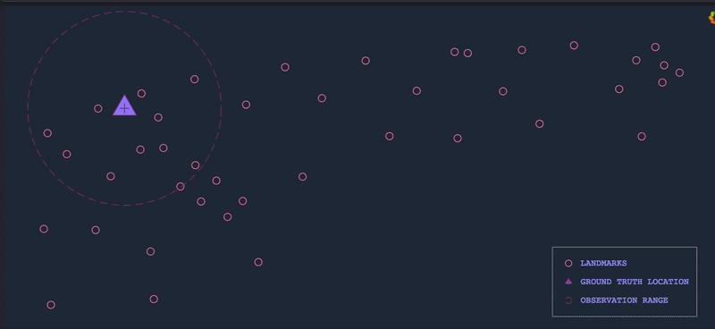
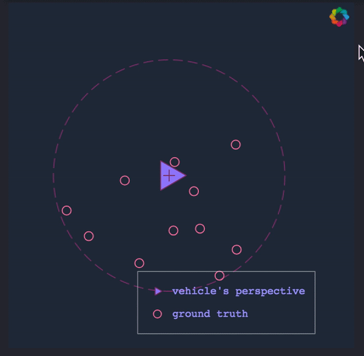
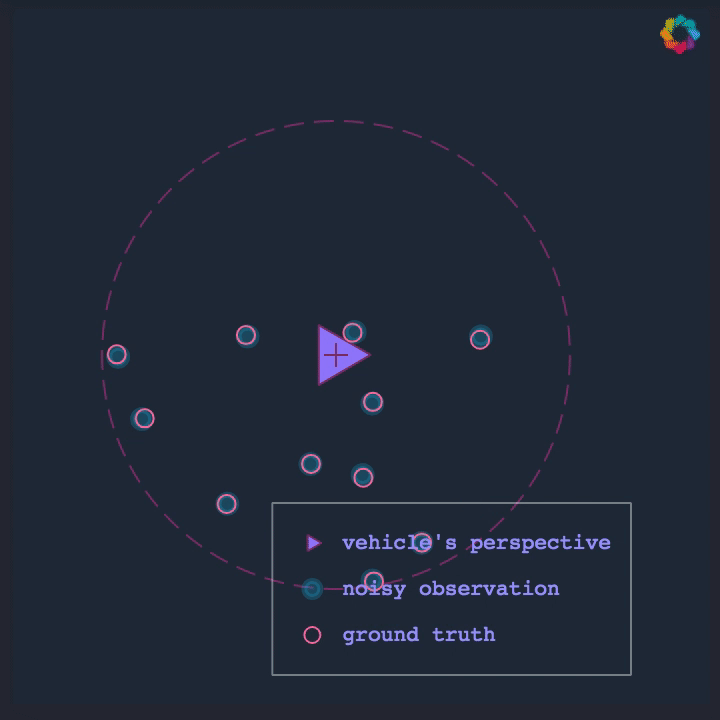

# Genetic Particle Filter (Still a work in progress) 

- K. S. P. J. H. KyungJin Rou, "A New Particle Filter Inspired by Biological Evolution: Genetic Filter," World Academy of Science, Engineering and Technology, no. 33, 2007.
- See also [Particle Filter Prototype Repository](https://github.com/mithi/particle-filter-prototype)

| Perfect Observation | Noisy Observation |
| ----------------------------- |:-------------------------------:|
|  | |

